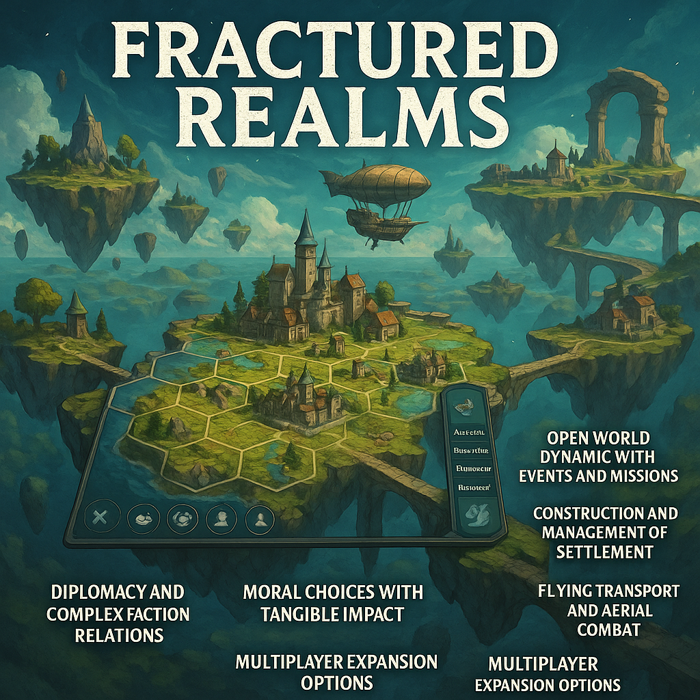

FRACTURED REALMS

E' un gioco strategico open world, ambientato in un mondo fantasy post-apocalittico, composto da isole galleggianti. Il giocatore guida una civiltà verso la sopravvivenza e l'espansione, gestendo risorse, diplomazia, guerre e magie o tecnologia.

OBBIETTIVI:

- Il sistema di gioco è basato su una mappa modulare esplorabile su pc e console con possibilità di sessioni online.

- fornisce strumenti gestionali per monitorare e ottimizzare le strategie adottate.

- Supporta un sistema decisoinale dinamico con conseguenze a lungo termine.

ARCHITTETURA DI GIOCO:

- Mondo con isole volanti.

- Simulazione gestionale per economia e popolazione.

- Sistema di diplomazia tra frazioni.

- Meccaniche di viaggio aereo e collegamento tra isole.

- Alberi evolutivi per magie e tecnologie.

FEATURE PRINCIPALI:

- Open world dinamico con eventi e missioni.

- Costruzioni e gestione di insediamento.

- Diplomazia e relazioni complesse tra fazioni.

- Scelte morali con impatti concreti.

- Mezzi di trasporto volanti e combattimenti aerei.

- Possibilità di esapnsione multiplayer.

REQUISTI UTENTE

- aaaaa
